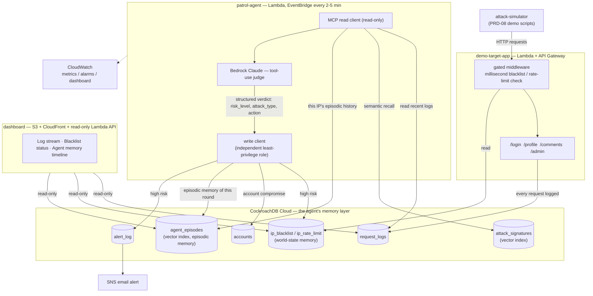

# CR-Sentinel

[](https://github.com/austinchennn/CR-Sentinel/actions/workflows/ci.yml)

**CR-Sentinel is a website security monitoring agent whose memory is CockroachDB.**

Traditional WAFs and IDS only do string matching and fixed thresholds — they recognize
templates, not intent. CR-Sentinel gives its agent a real, persistent memory instead:
attack semantics, past decisions, and IP behavior all live in CockroachDB, and every
patrol round starts by *recalling* that memory before judging new traffic. That's how it
catches things a signature-based WAF structurally can't: obfuscated/encoded injection
variants, slow-burn brute force, purely-syntactic IDOR walks, and chained, multi-step
intrusions that only look malicious in sequence.

Built for the [CockroachDB × AWS "Build with Agentic Memory" hackathon](https://cockroachdb-ai.devpost.com/).

- **Demo app URL:** _TODO — fill in after deploying `services/demo-target-app`_
- **Demo video (<3 min):** _TODO — record per `docs/05-demo-script.md`, upload to YouTube/Vimeo (public), link here_

## Architecture



The core idea, made concrete: **before Claude judges a new batch of traffic, it first
recalls (a) semantically similar attack signatures via CockroachDB's distributed vector
index, and (b) this specific IP's own history of past verdicts.** A second suspicious
round from an IP already flagged escalates instead of resetting to "normal" — that
escalation is only possible because the memory persists and is queried, not because of
any prompt trick. See `docs/01-architecture.md` for the full design (in Chinese; this
README summarizes the parts a judge needs).

### Known trade-off: 5-minute batch delay

`PatrolAgentLambda` runs on a 2-5 minute EventBridge schedule, not per-request — that's
a deliberate cost/complexity trade-off, not an oversight. It's compensated by a second,
independent layer: `demo-target-app`'s gateway (`gated` middleware) checks
`ip_blacklist`/`ip_rate_limit` directly on every request, millisecond-latency, before the
AI ever sees it. **Two layers: the gateway does immediate, cheap blocking; the agent does
deep, memory-informed judgment.** See `docs/01-architecture.md` §2.5 and §5 for the full
trade-off writeup.

## Repository layout

```
services/
  crdb-schema/         Schema, migrations, vector indexes, attack-signature seed data
  demo-target-app/     Intentionally vulnerable Lambda app -- the attack surface
  patrol-agent/        The agent: MCP read + Bedrock judge + independent write channel + SNS alerting + CloudWatch metrics
  dashboard/            Read-only Lambda API + static frontend -- the memory made visible
  attack-simulator/     CLI attack scripts for self-testing and the demo video
tests/                 Coverage-gap test suites, one per service (see tests/README.md)
docs/                  Design docs, PRDs, open issues, TODO, production-readiness writeup, demo script (Chinese)
.github/workflows/     CI: pytest + mypy for all five services on every push/PR
```

Each `services/*` directory deploys as its own independent set of Lambdas (own
`template.yaml`, own `requirements.txt`) — nothing is shared as a package across them, by
design (see any service's README for why).

## Setup / Run

Requires: an AWS account, a CockroachDB Cloud cluster with the Managed MCP Server
enabled, Bedrock model access (Claude + Titan Embeddings) approved in your AWS region,
and the AWS SAM CLI.

1. **Schema.** Apply migrations and seed attack signatures:
   ```bash
   cd services/crdb-schema
   pip install -r requirements.txt
   CRDB_ADMIN_URL="postgresql://...” scripts/run_migrations.sh
   CRDB_ADMIN_HOST=... CRDB_ADMIN_USER=... CRDB_ADMIN_PASSWORD=... python -m crdb_schema.seed_attack_signatures
   ```
2. **Demo target app.** `cd services/demo-target-app && sam deploy --guided` (see its
   README for the seed-accounts step).
3. **Patrol agent.** `cd services/patrol-agent && sam deploy --guided` — needs the MCP API
   key from the Cloud Console config snippet, the write role from `sql/patrol_write_role.sql`,
   and an `AlertEmail` for SNS (you'll need to click the confirmation email SNS sends).
4. **Dashboard.** `cd services/dashboard && sam deploy --guided`, then upload
   `frontend/index.html` to the `FrontendBucket` output and open the `FrontendUrl` output.
5. **Try it.** `cd services/attack-simulator && python -m attack_simulator.cli all --base-url <demo-app-url>`,
   then watch the Dashboard's Log Stream and (after the next patrol round) the Blacklist and
   Agent Memory Timeline views. Full walkthrough: `docs/05-demo-script.md`.

Every service also runs its own unit tests against fakes, no live cluster needed:
`cd services/<name> && pip install -r requirements.txt && python -m pytest -q`. CI
(`.github/workflows/ci.yml`) runs this plus `mypy` for all five services, plus the
coverage-gap suites under `tests/`, on every push and pull request.

## CockroachDB tools used

| Tool | How CR-Sentinel uses it |
|---|---|
| **Managed MCP Server** (`https://cockroachlabs.cloud/mcp`) | `patrol-agent`'s entire read path — recent `request_logs`, semantic recall against `attack_signatures`, and per-IP `agent_episodes` history all go through the read-only MCP `select_query` tool, never a direct SQL connection. See `services/patrol-agent/README.md`. |
| **Distributed Vector Indexing** | `attack_signatures` and `agent_episodes` both carry a `VECTOR(1024)` column (Titan Embeddings) with a `CREATE VECTOR INDEX`. Semantic recall of known attack patterns and of an IP's own history both run as ordinary `SELECT ... ORDER BY embedding <-> $vec` through that index — no separate vector store. |
| **ccloud CLI (agent-ready)** | Intended for cluster provisioning/backup config/audit-log access per `docs/01-architecture.md` §2.1 — not exercised from this repo's automated code path (that's a one-time, human-run setup step, see PRD-00 in `docs/prd/`). |

CR-Sentinel deliberately uses two independent CockroachDB access paths for different
trust levels: the **MCP read-only channel** for the agent's inference loop, and a
**separate least-privilege SQL write role** (`services/patrol-agent/sql/patrol_write_role.sql`,
INSERT/UPDATE-only on six specific tables, no DELETE/DROP/ALTER) for disposal writes —
never the same credential for both.

## AWS services used

| Service | How it's used |
|---|---|
| **Amazon Bedrock** | Claude (Converse API, forced tool-use) for the risk verdict; Titan Embeddings V2 for both query-time and seed-time vectors. |
| **AWS Lambda** | Every service (`demo-target-app`, `patrol-agent`, `dashboard`) is a set of Lambda functions — no persistent servers. |
| **Amazon API Gateway** | Fronts `demo-target-app` (the attack surface) and `dashboard`'s read-only API. |
| **Amazon EventBridge Scheduler** | Triggers `PatrolAgentLambda` every 2-5 minutes. |
| **Amazon SNS** | Emails a human on every high-risk verdict (`services/patrol-agent/patrol_agent/alerting.py`). |
| **Amazon S3 + CloudFront** | Static hosting for the Dashboard frontend, via Origin Access Control (no public bucket). |
| **Amazon CloudWatch** | Custom per-round metrics (`LogsRead`, `HighRiskVerdicts`, ...), alarms (function errors, MCP-unreachable streaks), and a dashboard — see `docs/06-production-readiness.md`. |
| **AWS Secrets Manager** | Source of truth for every credential injected into Lambda env vars at deploy time — nothing is hardcoded (verified by a repo-wide sweep, see `docs/06-production-readiness.md` §2). |
| **AWS IAM** | Least-privilege per function — see the full permission-by-permission table in `docs/06-production-readiness.md` §1. |

## Production readiness

- **Least privilege everywhere**: MCP read channel vs. independent write role vs. Dashboard's SELECT-only role, each with its own credentials; Lambda IAM policies scoped to the specific resources/model ARNs each function actually calls (not `Resource: "*"` by default).
- **Graceful degradation, not partial writes**: if the MCP channel is unreachable, the whole patrol round is skipped cleanly rather than acting on partial data; a Bedrock or embedding failure for one IP is logged and skipped without aborting the other IPs in the same round.
- **Idempotent disposal writes**: blacklist/rate-limit are `ON CONFLICT ... DO UPDATE` upserts keyed on IP, so re-judging the same IP as `high` never creates duplicate rows.
- **Observable**: CloudWatch custom metrics per patrol round, alarms on function errors and sustained MCP outages, a dashboard.
- **Honestly documented limitations**: the 5-minute batch delay (and its gateway-layer mitigation), and one known idempotency gap under Lambda retries that was investigated and deliberately not papered over with a fix that would have broken the memory-timeline feature — see `docs/06-production-readiness.md` §4 for the reasoning.

Full writeup: `docs/06-production-readiness.md`.

## Status

All 10 PRDs' code-level scope is complete except PRD-00 (AWS/CockroachDB account
provisioning — an operational step, not code) and the parts of PRD-06/PRD-07/PRD-08 that
need a live deployment to verify (SNS email confirmation, real Dashboard rendering, a real
patrol round producing a real verdict). See `docs/04-todo.md` for the full, current
checklist, and `docs/prd/` for each PRD's own status line.

## Docs

Design documents, PRDs, the open-issues log, and the production-readiness writeup are in
`docs/` — mostly in Chinese (the team's working language); this README is the English
summary Devpost judges need. Start with `docs/01-architecture.md` for the full design.

## License

MIT — see `LICENSE`.
